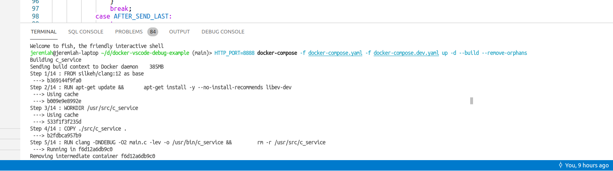
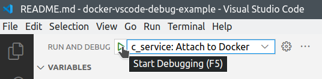
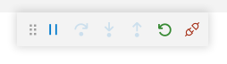
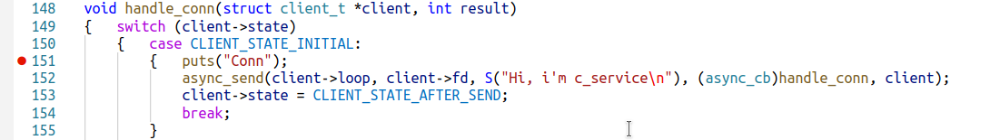
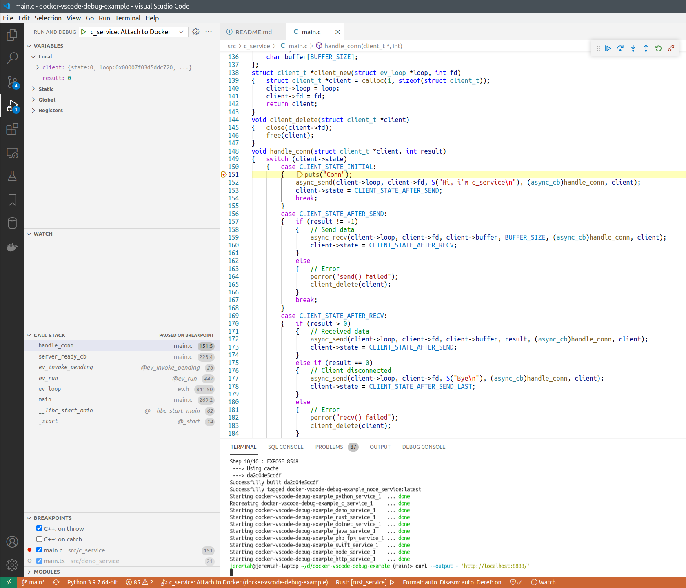
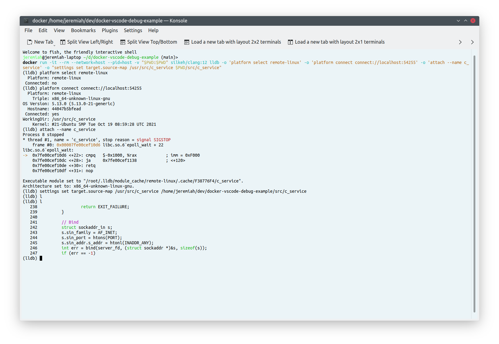

# TCP echo service with C: About

Rock'n'roll, stylish haircuts, cigarette smoke, and C programming language - this is the magic of 1970s.
Is this joy or pain to create Docker services in C, or maybe both, i don't know, but here is the example of one such service.

This is simple asynchronous TCP echo server implemented in C based on `libev`, to demonstrate how C services running in Docker containers can be remote-debugged from host machine.

## How to debug

See [main page](../../README.md) for how to run this project.



After `c_service` is started in Docker, you can attach VSCode debugger to the running process.



After you click "Start debugging" or press F5, the debugger will be attached, and you'll see these buttons:



Put breakpoint to some line of code that works each time a new connection to the service arrives:



Refresh the `http://localhost:8888/` page, or execute:

```bash
curl --output - 'http://localhost:8888/'
```

And the execution must stop on the breakpoint.



## How does it work

We need to install a debugger server inside our Docker container, and run it in parallel with the application.
Then VSCode debugger client (or some `lldb` command line client) will connect to this server, ask it to attach to our application process, and start debugging it.

We can use `gcc` + `gdb`, or `clang` + `lldb`.
In this project i use `clang`.

Note that the container is running in `--privileged` mode. Without this, the debugger client shows "Operation not permitted" error.

[Dockerfile](../../infra/c_service/Dockerfile) for this service looks like this:

```dockerfile
FROM silkeh/clang:12 as debug

# 1. Create user for the service.
RUN addgroup --gid=1969 c_service_user && \
	adduser --uid=1969 --gid=1969 --shell /bin/false --system c_service_user

# 1. Install libev-dev
RUN apt-get update && \
	apt-get install -y --no-install-recommends libev-dev && \
	apt-get clean && \
	rm -rf /var/lib/apt/lists/*

# 2. App source code will be copied to /usr/src/c_service for compilation.
#	Later i will delete it.
WORKDIR /usr/src/c_service

# 3. Copy app source code
COPY ./src/c_service .

# 4. Compile 2 versions: debug and release.
#	Store the debug binary at /usr/bin/c_service, and the release binary at /usr/bin/c_service_release.
#	Then delete the source code.
RUN clang -O0 -g main.c -lev -o /usr/bin/c_service && \
	clang -DNDEBUG -O2 main.c -lev -o /usr/bin/c_service_release && \
	rm -r /usr/src/c_service

# 5. How to run the service
WORKDIR /home/c_service_user
CMD ["bash", "-c", "lldb-server platform --server --listen 0.0.0.0:2201 --gdbserver-port 9850 & /usr/bin/c_service"]

# app service port
EXPOSE 8543
# lldb-server listens for connections
EXPOSE 2201
# lldb-server service port
EXPOSE 9850
```

First, in base image, i `apt`-install `libev-dev`, and `clang`-compile the application.
Then in debug image i recompile for debug, and the startup command looks like this: `bash -c 'lldb-server platform --server --listen 0.0.0.0:2201 --gdbserver-port 9850 & /usr/bin/c_service'`.
It starts `lldb-server` in parallel with our app service.

We expose 2 debugger ports (2201 and 9850) to the host machine together with the app service port (8543).

In [launch.json](../../.vscode/launch.json) we have these settings for the VSCode debugger:

```json
{	"name": "c_service: Attach to Docker",
	"type": "lldb",
	"request": "attach",
	"program": "/usr/bin/c_service", // assuming that the service is running under this name in the container
	"initCommands":
	[	"platform select remote-linux",
		"platform connect connect://localhost:2201",
		"settings set target.inherit-env false",
		"settings set target.source-map /usr/src/c_service ${workspaceFolder}/src/c_service"
	]
}
```

So the debugger client will connect to `localhost:2201`, that is mapped to our service port inside Docker.

It's also possible to debug with `lldb` client installed on your machine, bypassing VSCode, or to run lldb from a Docker image:

```bash
# from project root directory
docker run -it --rm --network=host --pid=host -v "$PWD:$PWD" silkeh/clang:12 lldb -o 'platform select remote-linux' -o 'platform connect connect://localhost:2201' -o 'attach --name c_service' -o "settings set target.source-map /usr/src/c_service $PWD/src/c_service"
```


