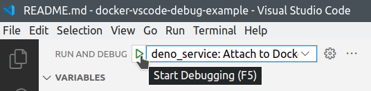
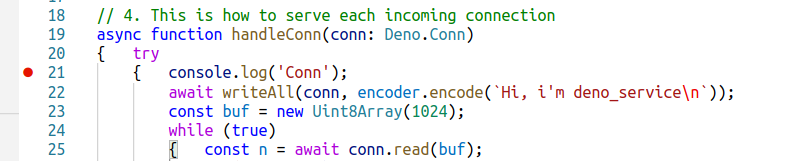
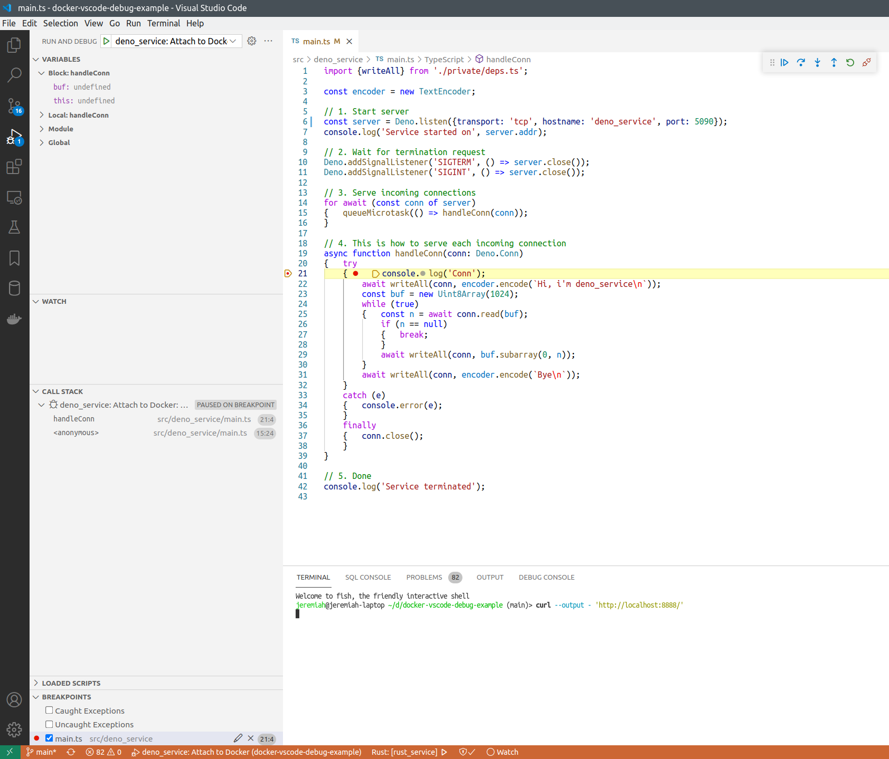

# TCP echo service with Deno: About

This is simple TCP echo server implemented in Typescript/Deno, to demonstrate how Deno services running in Docker containers can be remote-debugged from host machine.

## How to debug

See [main page](../../README.md) for how to run this project.


After `deno_service` is started in Docker, you can attach VSCode debugger to the running process.



After you click "Start debugging" or press F5, the debugger will be attached, and you'll see these buttons:


Put breakpoint to some line of code that works each time a new connection to the service arrives:



Refresh the `http://localhost:8888/` page, or execute:

```bash
curl --output - 'http://localhost:8888/'
```

And the execution must stop on the breakpoint.



## How does it work

[Dockerfile](../../infra/deno_service/Dockerfile) for this service looks like this:

```dockerfile
FROM denoland/deno:debian-1.16.2 as debug

# 1. To improve build time, copy deps.ts, and cache the app dependencies.
USER deno
COPY ./src/deno_service/private/deps.ts /tmp/deps.ts
RUN deno cache --unstable /tmp/deps.ts
USER root
RUN rm /tmp/deps.ts

# 2. Source code will be copied to here.
WORKDIR /usr/src/deno_service

# 3. Copy the app
COPY --chown=root:root ./src/deno_service .

# 4. On first run deno checks source files. I want to check them only once at build time.
USER deno
RUN deno cache --unstable main.ts && \
	find . -name '*.test.ts' | xargs --no-run-if-empty deno cache --unstable

CMD ["run", "--unstable", "--allow-net", "--inspect=0.0.0.0:48050", "main.ts"]

# app service port
EXPOSE 5090
# debugger port
EXPOSE 48050
```

To start our service, we run `deno` command with debugger parameters. The debugger server (Chrome Debugging Protocol) will be listening on `0.0.0.0:48050` (default route, port 48050).
We expose the debugger port to the host machine together with the app service port.

In [launch.json](../../.vscode/launch.json) we have these settings for the VSCode debugger:

```json
{	"name": "deno_service: Attach to Docker",
	"type": "pwa-node",
	"request": "attach",
	"port": 48050,
	"localRoot": "${workspaceFolder}/src/deno_service",
	"remoteRoot": "/usr/src/deno_service"
}
```

So the debugger client will connect to `localhost:48050`, that is mapped to our service port inside Docker.
