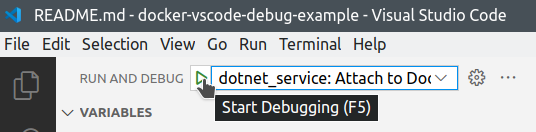
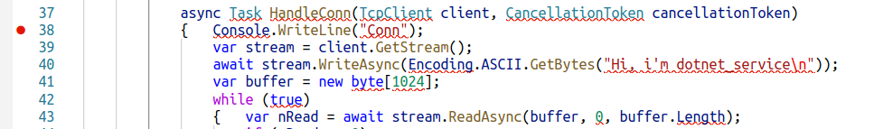
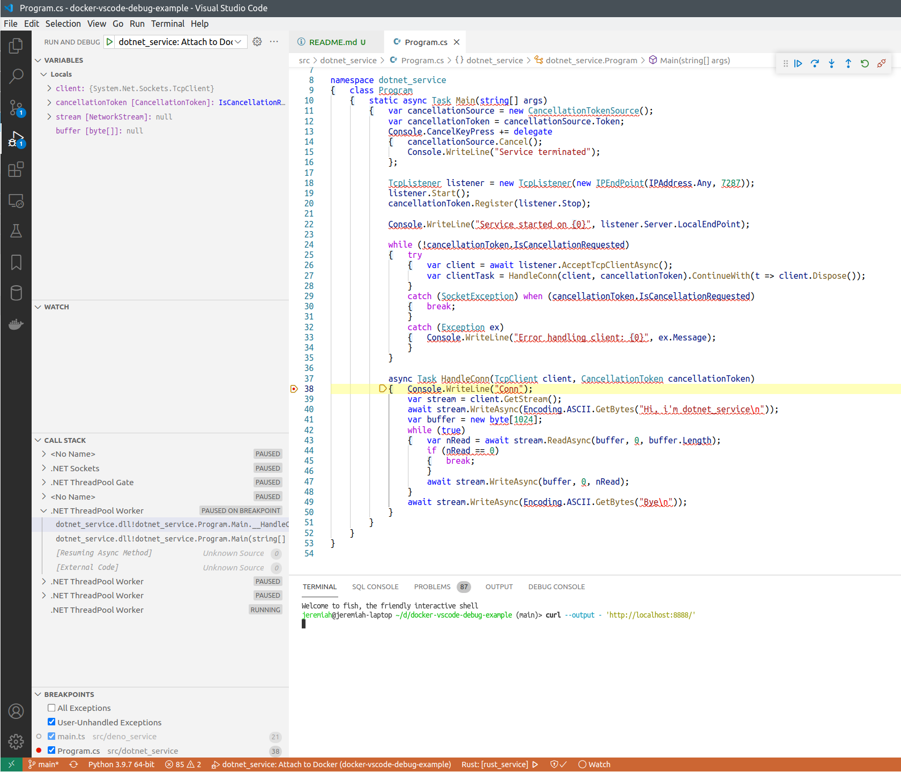

# TCP echo service with C#: About

This is simple asynchronous TCP echo server implemented in C#, to demonstrate how Dotnet services running in Docker containers can be remote-debugged from host machine.

Files here were generated like this:

```bash
dotnet new console
```

Then the service implementation was written in [Program.cs](./Program.cs).

## How to debug

See [main page](../../README.md) for how to run this project.


After `dotnet_service` is started in Docker, you can attach VSCode debugger to the running process.



After you click "Start debugging" or press F5, the debugger will be attached, and you'll see these buttons:


Put breakpoint to some line of code that works each time a new connection to the service arrives:



Refresh the `http://localhost:8888/` page, or execute:

```bash
curl --output - 'http://localhost:8888/'
```

And the execution must stop on the breakpoint.



## How does it work

[Dockerfile](../../infra/java_service/Dockerfile) for this service looks like this:

```dockerfile
FROM mcr.microsoft.com/dotnet/sdk:6.0 as debug

# Install vsdbg (dotnet debugger).
RUN apt-get update && \
	apt-get install -y --no-install-recommends unzip && \
	rm -rf /var/lib/apt/lists/* && \
	curl -sSL https://aka.ms/getvsdbgsh | /bin/sh /dev/stdin -v latest -l /usr/bin/vsdbg

WORKDIR /usr/src/dotnet_service

# Cache dependencies
COPY ./src/dotnet_service/dotnet_service.csproj ./dotnet_service.csproj
RUN dotnet restore

# Release build that will not be used in this image, but will be copied to the production image.
COPY ./src/dotnet_service .
RUN mkdir /usr/bin/dotnet_service && \
	dotnet publish --configuration Release --output /usr/bin/dotnet_service

CMD ["dotnet", "run"]

# app service port
EXPOSE 7287
```

First need to install official Microsoft component for debugging C# - it's downloaded from https://aka.ms/getvsdbgsh and installed.

VSCode C# debugger knows to connect to Docker container and use the installed `vsdbg` component.
For this to work we need to specify container name in our [launch.json](../../.vscode/launch.json) file:

```json
{	"name": "dotnet_service: Attach to Docker",
	"type": "coreclr",
	"request": "attach",
	"processName": "/usr/src/dotnet_service/bin/Debug/net6.0/dotnet_service", // assuming that the service is running under this name in the container
	"pipeTransport":
	{	"pipeProgram": "docker",
		"pipeArgs": ["exec", "-i", "docker-vscode-debug-example_dotnet_service_1"], // assuming that the name of the container is "docker-vscode-debug-example_dotnet_service_1"
		"debuggerPath": "/usr/bin/vsdbg/vsdbg",
		"pipeCwd": "${workspaceRoot}",
		"quoteArgs": false
	},
	"sourceFileMap":
	{	"/usr/src/dotnet_service": "${workspaceRoot}/src/dotnet_service"
	}
}
```

In this project the container name is assumed to be `docker-vscode-debug-example_dotnet_service_1`.

## See also

[Debugging your .NET Core in Docker applications with VS Code](https://www.aaron-powell.com/posts/2019-04-04-debugging-dotnet-in-docker-with-vscode/)
