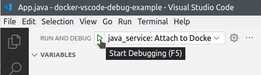
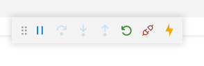
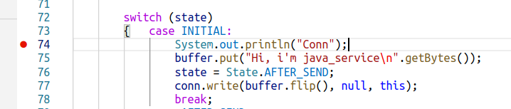
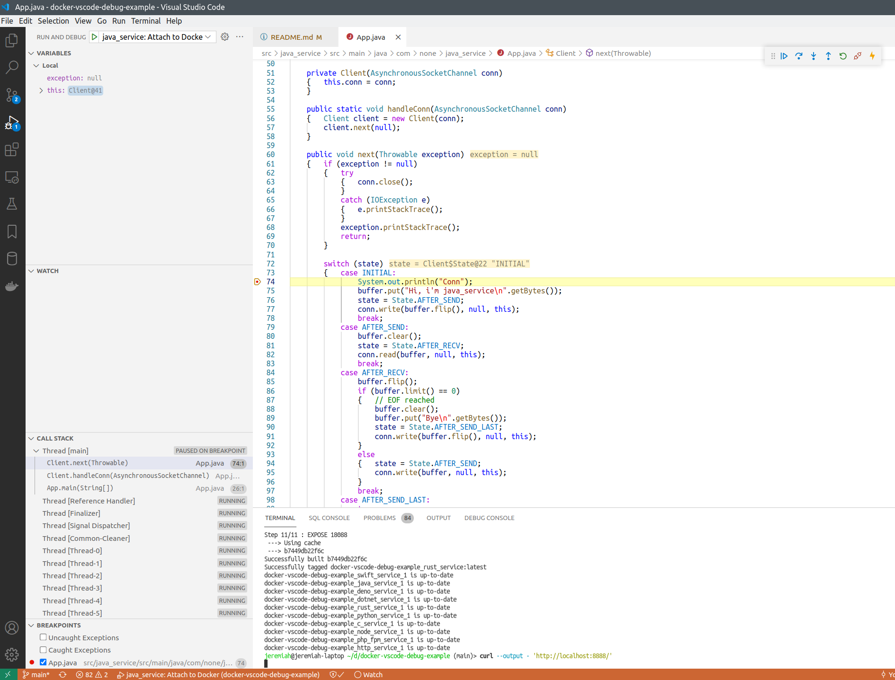

## TCP echo service with Java: About

This is simple asynchronous TCP echo server implemented in Java, to demonstrate how Java services running in Docker containers can be remote-debugged from host machine.

Files here were generated like this:

```bash
mvn archetype:generate -DgroupId=com.none.java_service -DartifactId=java_service -DarchetypeArtifactId=maven-archetype-quickstart -DarchetypeVersion=1.4 -DinteractiveMode=false
```

Then the service implementation was written in [src/main/java/com/none/java_service/App.java](./src/main/java/com/none/java_service/App.java).

## How to debug

See [main page](../../README.md) for how to run this project.


After `java_service` is started in Docker, you can attach VSCode debugger to the running process.



After you click "Start debugging" or press F5, the debugger will be attached, and you'll see these buttons:



Put breakpoint to some line of code that works each time a new connection to the service arrives:



Refresh the `http://localhost:8888/` page, or execute:

```bash
curl --output - 'http://localhost:8888/'
```

And the execution must stop on the breakpoint.



## How does it work

[Dockerfile](../../infra/java_service/Dockerfile) for this service looks like this:

```dockerfile
FROM maven:3.8.3-jdk-11 as debug

# 1. Create user and group for the service.
#	I use 1205 as user and group id.
#	I think giving different user ids to different services improves isolation.
RUN addgroup --gid=1205 java_service_user && \
	adduser --uid=1205 --gid=1205 --shell /bin/false --system java_service_user

# 2. Source code will be copied and compiled in this directory.
#	Later i'll delete it.
WORKDIR /usr/src/java_service

# 3. Cache dependencies
COPY ./src/java_service/pom.xml .
RUN mvn verify clean --fail-never

# 4. Build
COPY ./src/java_service .
RUN mvn -B package && \
	mkdir /usr/lib/java_service && \
	mv target/java_service-1.0-SNAPSHOT.jar /usr/lib/java_service/java_service.jar && \
	chown -R root:java_service_user /usr/lib/java_service && \
	chmod -R 750 /usr/lib/java_service && \
	rm -rf /usr/src/java_service

# 5. How to run the app.
WORKDIR /home/java_service_user
USER java_service_user
ENV MAVEN_CONFIG=/home/java_service_user
CMD ["java", "-agentlib:jdwp=transport=dt_socket,server=y,suspend=n,address=*:9455", "-cp", "/usr/lib/java_service/java_service.jar", "com.none.java_service.App"]

# app service port
EXPOSE 27712
# debugger port
EXPOSE 9455
```

To start our service, we run `java` command with debugger parameters. The Java debugger server will be listening on `*:9455` (default route, port 9455).
We expose the debugger port to the host machine together with the app service port.

In [launch.json](../../.vscode/launch.json) we have these settings for the VSCode debugger:

```json
{	"name": "java_service: Attach to Docker",
	"type": "java",
	"request": "attach",
	"hostName": "localhost",
	"port": 9455,
	"projectName": "java_service",
	"sourcePaths": ["${workspaceFolder}/src/java_service/src/main/java"]
}
```

So the debugger client will connect to `localhost:9455`, that is mapped to our service port inside Docker.

`"request": "attach"` tells the debugger to attach to already running process, not to launch a new application.

## See also

- [Running and debugging Java - Attach](https://code.visualstudio.com/docs/java/java-debugging#_attach)
- [What are Java command line options to set to allow JVM to be remotely debugged?](https://stackoverflow.com/questions/138511/what-are-java-command-line-options-to-set-to-allow-jvm-to-be-remotely-debugged)
