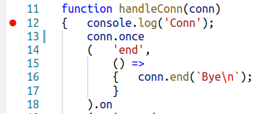
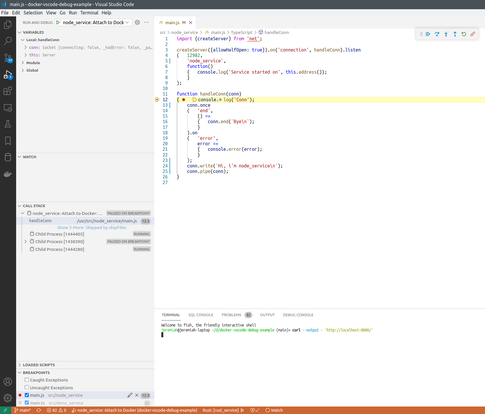

# TCP echo service with Node JS: About

This is simple TCP echo server implemented in Javascript/Node, to demonstrate how Node services running in Docker containers can be remote-debugged from host machine.

## How to debug

See [main page](../../README.md) for how to run this project.


After `node_service` is started in Docker, you can attach VSCode debugger to the running process.


After you click "Start debugging" or press F5, the debugger will be attached, and you'll see these buttons:


Put breakpoint to some line of code that works each time a new connection to the service arrives:



Refresh the `http://localhost:8888/` page, or execute:

```bash
curl --output - 'http://localhost:8888/'
```

And the execution must stop on the breakpoint.



## How does it work

[Dockerfile](../../infra/node_service/Dockerfile) for this service looks like this:

```dockerfile
FROM node:17.1.0-alpine3.14 as debug

WORKDIR  /usr/src/node_service

# Cache dependencies
COPY --chown=root:root ./src/node_service/package.json ./package.json
RUN npm install

COPY --chown=root:root ./src/node_service .
RUN chown -R root:node . && \
	chmod -R 750 .

WORKDIR /usr/src/node_service
USER node
CMD ["node", "--inspect=0.0.0.0:8548", "main.js"]

# app service port
EXPOSE 12982
# debugger port
EXPOSE 8548
```

To start our service, we run `node` command with debugger parameters. The debugger server (Chrome Debugging Protocol) will be listening on `0.0.0.0:8548` (default route, port 8548).
We expose the debugger port to the host machine together with the app service port.

In [launch.json](../../.vscode/launch.json) we have these settings for the VSCode debugger:

```json
{	"name": "node_service: Attach to Docker",
	"type": "pwa-node",
	"request": "attach",
	"port": 8548,
	"localRoot": "${workspaceFolder}/src/node_service",
	"remoteRoot": "/usr/src/node_service"
}
```

So the debugger client will connect to `localhost:8548`, that is mapped to our service port inside Docker.
