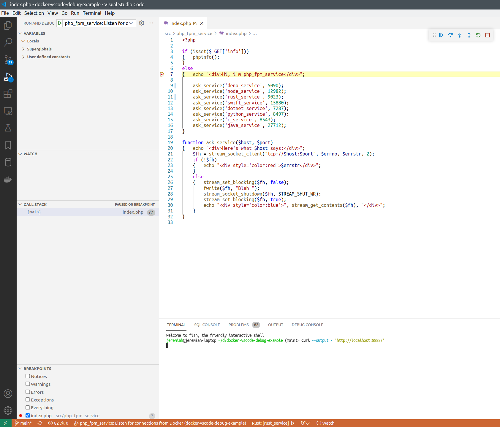

## PHP FPM Docker service

This is simple PHP FPM service, that demonstrates how PHP applications running in Docker containers can be remote-debugged from host machine.

This service listens for FastCGI requests on port 21104.

See [main page](../../README.md) for how to run this project.

`http_service` forwards requests to PHP files to this service.
This service has 1 PHP page called `index.php`.
This PHP script queries all other services in this project, and prints on the generated page what answers they return.

On each request to `index.php`, the PHP debugger (XDebug) wants to connect to debugger server. It connects to host machine, to port 33078 (`host.docker.internal:33078`).

To start PHP debugger server on host machine, select the corresponding configuration, and click "Start debugging" or press F5:


Then you can put a breakpoint:


Refresh the `http://localhost:8888/` page, or execute:

```bash
curl --output - 'http://localhost:8888/'
```

And the execution must stop on the breakpoint.


