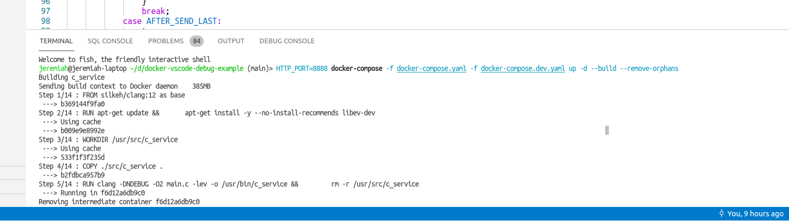
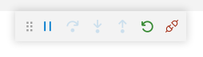
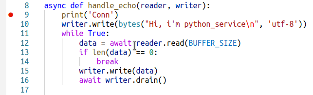

# TCP echo service with Python: About

This is simple asynchronous TCP echo server implemented in Python, to demonstrate how Python services running in Docker containers can be remote-debugged from host machine.

## How to debug

See [main page](../../README.md) for how to run this project.



After `python_service` is started in Docker, you can attach VSCode debugger to the running process.


After you click "Start debugging" or press F5, the debugger will be attached, and you'll see these buttons:



Put breakpoint to some line of code that works each time a new connection to the service arrives:



Refresh the `http://localhost:8888/` page, or execute:

```bash
curl --output - 'http://localhost:8888/'
```

And the execution must stop on the breakpoint.


## How does it work

[Dockerfile](../../infra/python_service/Dockerfile) for this service looks like this:

```dockerfile
# ------------------------------------------------------------------------------
# Base image to be used by both debug and production
# ------------------------------------------------------------------------------

FROM python:3.10-alpine3.14 as base

RUN adduser -u 1675 -g 1675 -s /bin/false -D python_service_user

WORKDIR /usr/src/python_service
USER python_service_user

COPY ./src/python_service/requirements.txt ./requirements.txt
RUN pip install -r requirements.txt


# ------------------------------------------------------------------------------
# Debug image
# ------------------------------------------------------------------------------

FROM base as debug

# Install Python debugger for Vscode
RUN pip install ptvsd

WORKDIR /usr/src/python_service
USER python_service_user

COPY ./src/python_service .

CMD ["python", "-m", "ptvsd", "--host", "0.0.0.0", "--port", "22742", "--multiprocess", "main.py"]

# app service port = 8497
# debugger port = 22742
EXPOSE 8497 22742
```

To start our service, we run `python` command with debugger parameters. The debugger server (ptvsd) will be listening on `0.0.0.0:22742` (default route, port 22742).
We expose the debugger port to the host machine together with the app service port.

In [launch.json](../../.vscode/launch.json) we have these settings for the VSCode debugger:

```json
{	"name": "python_service: Attach to Docker",
	"type": "python",
	"request": "attach",
	"port": 22742,
	"localRoot": "${workspaceFolder}/src/python_service",
	"remoteRoot": "/usr/src/python_service"
}
```

So the debugger client will connect to `localhost:22742`, that is mapped to our service port inside Docker.
