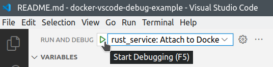
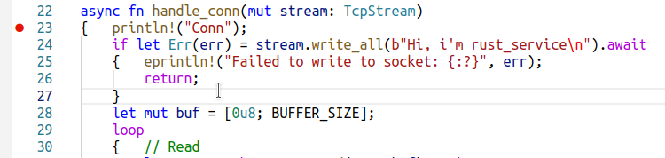
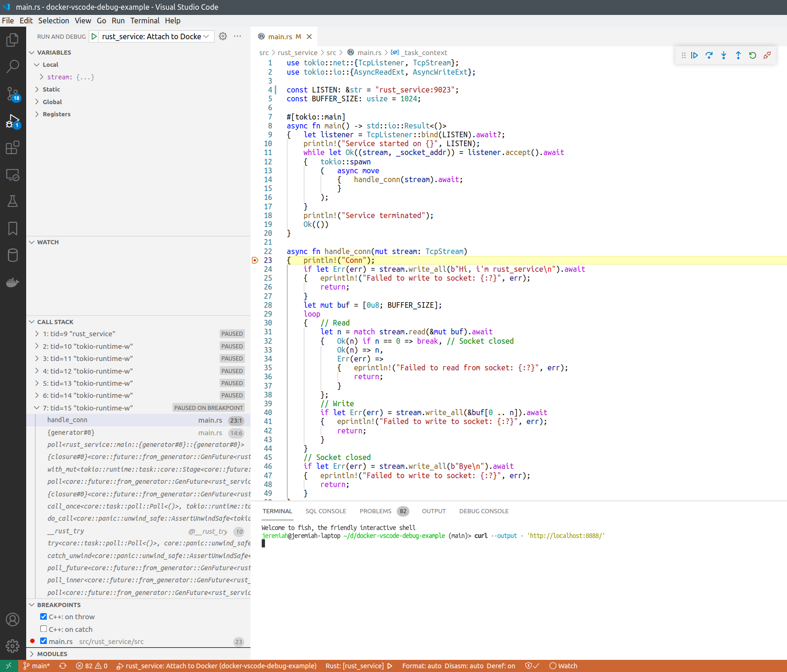
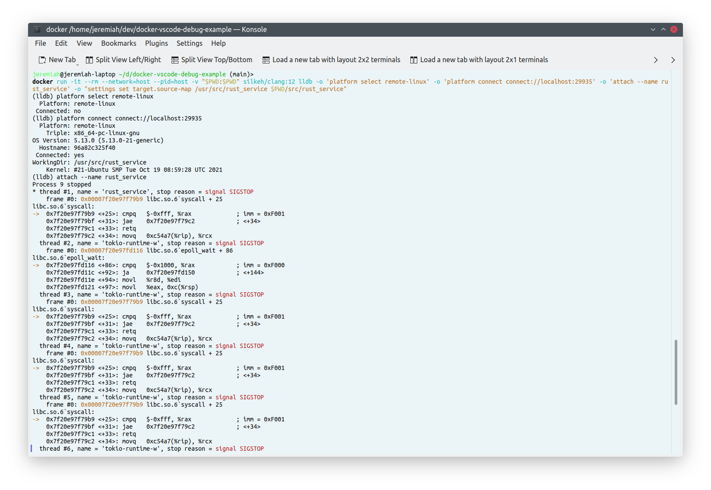

## TCP echo service with Rust: About

This is simple asynchronous TCP echo server implemented in Rust, to demonstrate how Rust services running in Docker containers can be remote-debugged from host machine.

Files here were generated like this:

```bash
cargo init
```

Then the service implementation was written in [src/main.rs](./src/main.rs).

## How to debug

See [main page](../../README.md) for how to run this project.


After `rust_service` is started in Docker, you can attach VSCode debugger to the running process.



After you click "Start debugging" or press F5, the debugger will be attached, and you'll see these buttons:


Put breakpoint to some line of code that works each time a new connection to the service arrives:



Refresh the `http://localhost:8888/` page, or execute:

```bash
curl --output - 'http://localhost:8888/'
```

And the execution must stop on the breakpoint.



## How does it work

For this to work, we need to install `lldb` debugger server inside our Docker container, and run it in parallel with our application.

[Dockerfile](../../infra/rust_service/Dockerfile) for this service looks like this:

```dockerfile
FROM rust:1.56 as debug

# 1. Install lldb-server, that will be running together with the app.
RUN apt-get update && \
	apt-get install -y --no-install-recommends lldb && \
	rm -rf /var/lib/apt/lists/*

# 2. App source code will be copied to /usr/src/rust_service for compilation.
#	Later i will delete it.
WORKDIR /usr/src/rust_service

# 3. To improve build time, we want to create stub app that will have our Cargo.toml file,
#	so it will have the same dependencies.
#	We want to download the dependencies on this stage.
COPY ./src/rust_service/Cargo.toml Cargo.toml
RUN mkdir src && \
	echo 'fn main() {println!("Image build incomplete")}' > src/main.rs && \
	cargo build && \
	rm -f target/debug/deps/rust_service*

# 4. Copy app source code, and compile it.
#	Store the resulting binary at /usr/bin/rust_service.
COPY ./src/rust_service .
RUN cargo build && \
	mv target/debug/rust_service -t /usr/bin

# 5. Run the app + lldb-server in background.
CMD ["bash", "-c", "lldb-server platform --server --listen 0.0.0.0:29935 --gdbserver-port 18088 & /usr/bin/rust_service"]

# app service port
EXPOSE 54329
# lldb-server listens for connections
EXPOSE 29935
# lldb-server service port
EXPOSE 18088
```

First i `apt`-install `lldb` package, that also includes `lldb-server`.
Then the application is compiled, and the startup command looks like this: `bash -c 'lldb-server platform --server --listen 0.0.0.0:29935 --gdbserver-port 18088 & /usr/bin/rust_service'`.
It starts `lldb-server` that is listening on `0.0.0.0:29935`, and also our app service in parallel.

We expose 2 debugger ports (29935 and 18088) to the host machine together with the app service port (54329).

In [launch.json](../../.vscode/launch.json) we have these settings for the VSCode debugger:

```json
{	"name": "rust_service: Attach to Docker",
	"type": "lldb",
	"request": "attach",
	"program": "/usr/bin/rust_service", // assuming that the service is running under this name in the container
	"initCommands":
	[	"platform select remote-linux",
		"platform connect connect://localhost:29935",
		"settings set target.inherit-env false",
		"settings set target.source-map /usr/src/rust_service ${workspaceFolder}/src/rust_service"
	]
}
```

So the debugger client will connect to `localhost:29935`, that is mapped to our service port inside Docker.

It's also possible to debug with `lldb` client installed on your machine, bypassing VSCode, or to run lldb from a Docker image:

```bash
# from project root directory
docker run -it --rm --network=host --pid=host -v "$PWD:$PWD" silkeh/clang:12 lldb -o 'platform select remote-linux' -o 'platform connect connect://localhost:29935' -o 'attach --name rust_service' -o "settings set target.source-map /usr/src/rust_service $PWD/src/rust_service"
```


