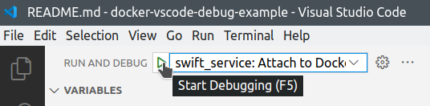
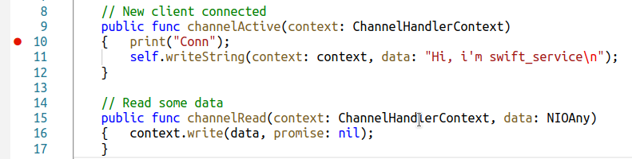
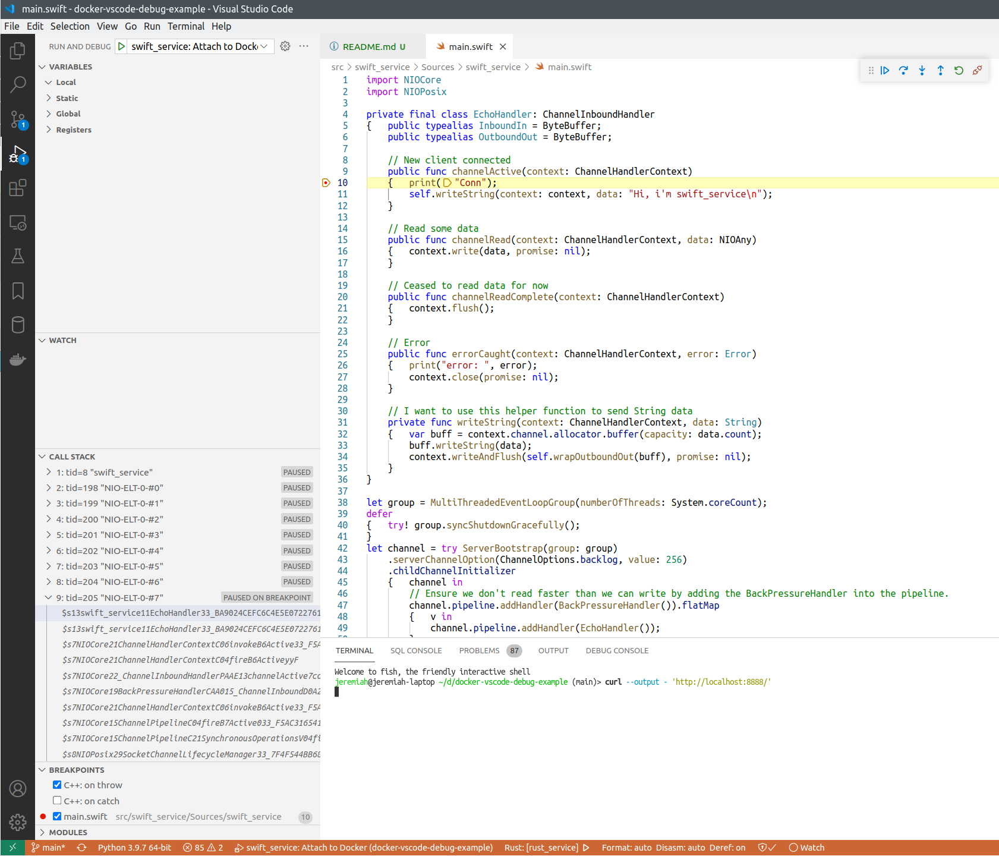

## TCP echo service with Swift: About

This is simple asynchronous TCP echo server implemented in Swift, to demonstrate how Swift services running in Docker containers can be remote-debugged from host machine.

Files here were generated like this:

```bash
swift package init --type executable
```

Then the service implementation was written in [Sources/swift_service/main.swift](./Sources/swift_service/main.swift).

## How to debug

See [main page](../../README.md) for how to run this project.


After `swift_service` is started in Docker, you can attach VSCode debugger to the running process.



After you click "Start debugging" or press F5, the debugger will be attached, and you'll see these buttons:


Put breakpoint to some line of code that works each time a new connection to the service arrives:



Refresh the `http://localhost:8888/` page, or execute:

```bash
curl --output - 'http://localhost:8888/'
```

And the execution must stop on the breakpoint.



## How does it work

For this to work, we need to install `lldb` debugger server inside our Docker container, and run it in parallel with our application.

[Dockerfile](../../infra/swift_service/Dockerfile) for this service looks like this:

```dockerfile
FROM swift:5.5.1 as debug

# 1. App source code will be copied to /usr/src/swift_service for compilation.
WORKDIR /usr/src/swift_service

# 2. Cache dependencies.
COPY ./src/swift_service/Package.swift ./
RUN swift package resolve

# 3. Copy app source code.
COPY ./src/swift_service .

# 4. Compile 2 versions: debug and release.
#	Store the debug binary at /usr/bin/swift_service, and the release binary at /usr/bin/swift_service_release.
#	Then delete intemediate build files.
RUN swift build -Xswiftc -g && \
	swift build -c release && \
	mv .build/debug/swift_service /usr/bin/swift_service && \
	mv .build/release/swift_service /usr/bin/swift_service_release && \
	rm -rf .build

# 5. Run the app + lldb-server in background.
CMD ["bash", "-c", "lldb-server platform --server --listen 0.0.0.0:2418 --gdbserver-port 16276 & /usr/bin/swift_service"]

# app service port
EXPOSE 15880
# lldb-server listens for connections
EXPOSE 2418
# lldb-server service port
EXPOSE 16276
```

The startup command looks like this: `bash -c 'lldb-server platform --server --listen 0.0.0.0:2418 --gdbserver-port 16276 & swift run'`.
It starts `lldb-server` that is listening on `0.0.0.0:2418`, and also our app service in parallel.

We expose 2 debugger ports (2418 and 16276) to the host machine together with the app service port (15880).

In [launch.json](../../.vscode/launch.json) we have these settings for the VSCode debugger:

```json
{	"name": "swift_service: Attach to Docker",
	"type": "lldb",
	"request": "attach",
	"program": ".build/x86_64-unknown-linux-gnu/debug/swift_service", // assuming that the service is running under this name in the container
	"initCommands":
	[	"platform select remote-linux",
		"platform connect connect://localhost:2418",
		"settings set target.inherit-env false",
		"settings set target.source-map /usr/src/swift_service ${workspaceFolder}/src/swift_service"
	]
}
```

So the debugger client will connect to `localhost:2418`, that is mapped to our service port inside Docker.
